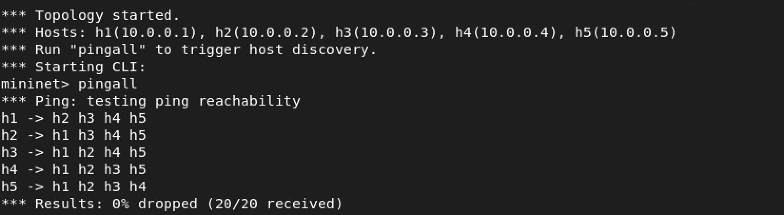
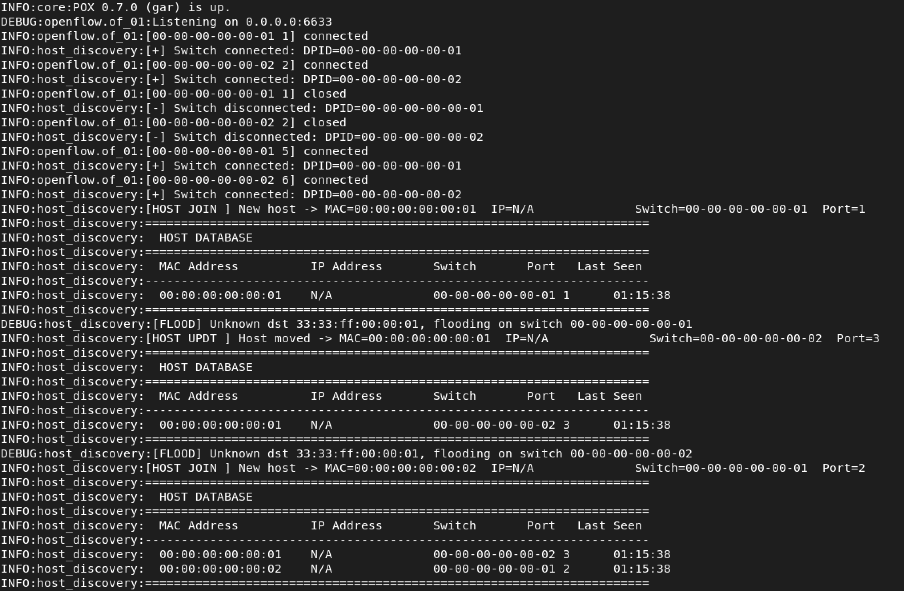
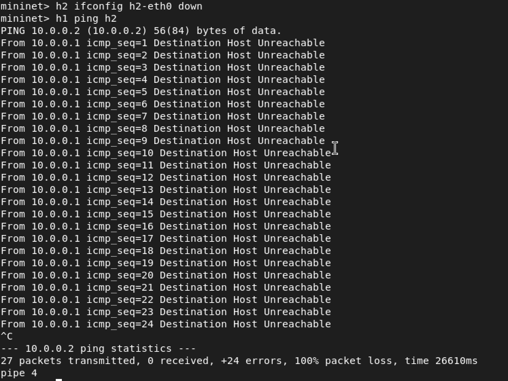
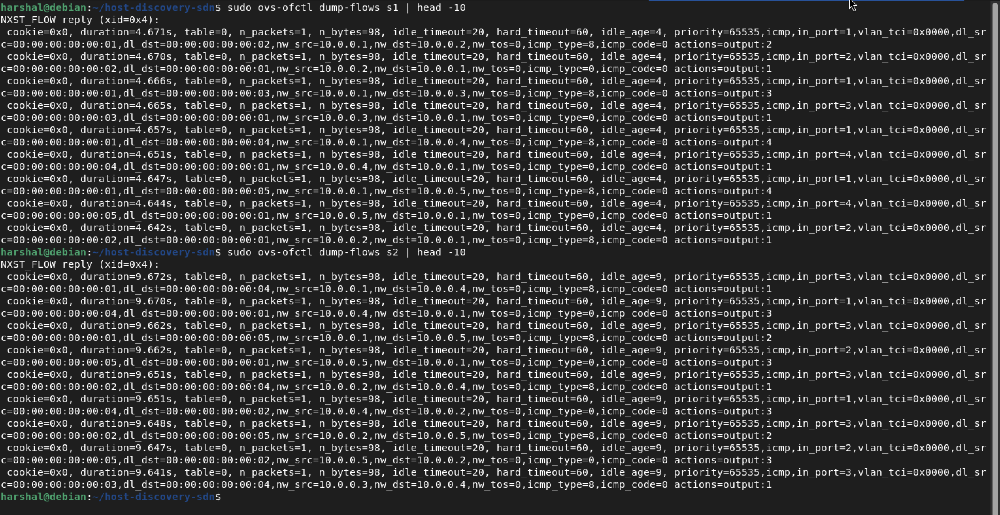
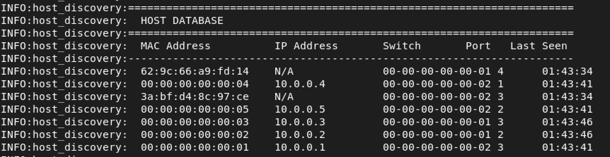
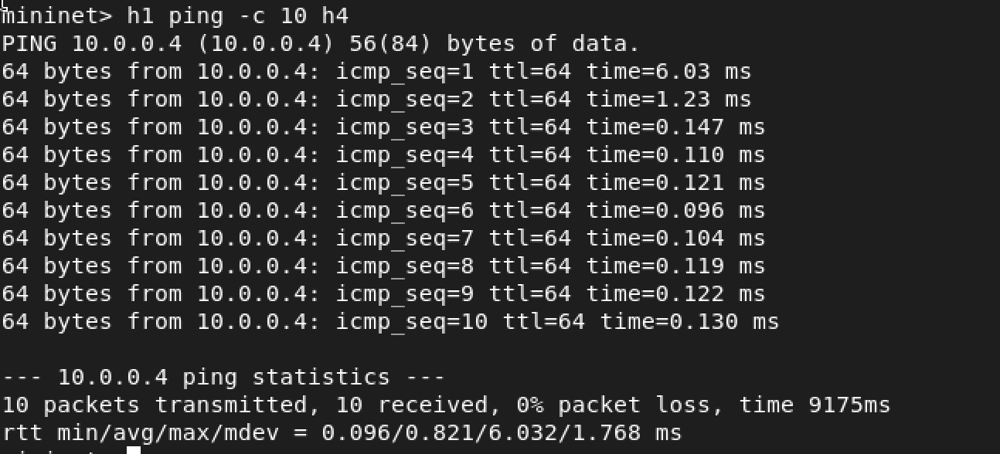
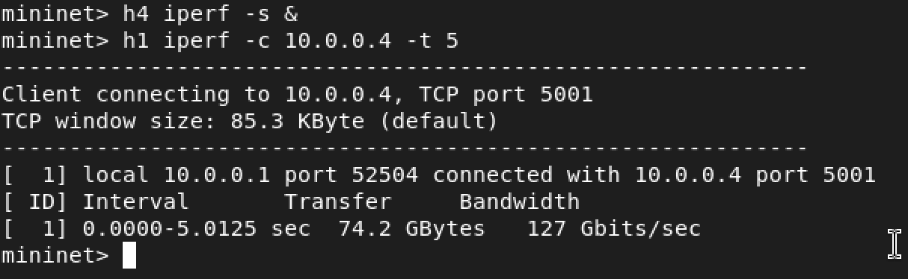

# 🌐 Host Discovery Service using SDN (Mininet + POX)

---

## 📌 Overview

This project implements a **Host Discovery Service** in a Software Defined Networking (SDN) environment using **Mininet** as the network emulator and the **POX controller** for centralized network control. The controller dynamically detects hosts via `packet_in` events, maintains a live host database, and installs OpenFlow flow rules to enable efficient, scalable packet forwarding — demonstrating core SDN principles end-to-end.

A **two-switch, five-host topology** was chosen deliberately: it forces cross-switch host discovery, exercises the inter-switch link, and proves the controller maintains a global network view across multiple datapaths — not just a trivially single-switch scenario.

---

## 📌 Objectives

- Dynamically detect and register hosts as they join the network
- Maintain a real-time host database (MAC, IP, switch DPID, port, timestamp)
- Implement learning switch behavior at the controller level
- Install and verify OpenFlow flow rules for efficient forwarding
- Demonstrate SDN controller–switch interaction using Mininet

---

## 📌 Network Topology

```
  h1 ─┐                    ┌─ h4
  h2 ─┼─── s1 ──────── s2 ─┼─ h5
  h3 ─┘                    └─────
```

| Component | Details |
|-----------|---------|
| **Switches** | `s1`, `s2` |
| **Hosts on s1** | `h1`, `h2`, `h3` |
| **Hosts on s2** | `h4`, `h5` |
| **Inter-switch link** | `s1 ↔ s2` |
| **Controller** | POX (OpenFlow 1.0) |

**Why this topology?** Two switches connected by a trunk link create an environment where hosts on different switches must communicate via the controller's global view. This tests cross-DPID host tracking, inter-switch flow rule installation, and flooding behaviour on the inter-switch port — scenarios absent from a single-switch setup.

---

## 📌 Prerequisites

Make sure the following are installed on your system (tested on Ubuntu 20.04+):

```bash
sudo apt-get install mininet python3 iperf -y
```

- [Mininet](https://mininet.org/) — network emulator
- [POX Controller](https://github.com/noxrepo/pox) — Python-based OpenFlow controller
- Open vSwitch (`ovs-ofctl`) — for flow table inspection

Clone this repository into your POX `ext/` directory so the controller module is discoverable:

```bash
cp host_discovery.py ~/pox/ext/
```

---

## 📌 Project Structure

```
.
├── host_discovery.py     # POX controller module
├── topology.py           # Mininet custom topology
├── README.md
└── screenshots/
    ├── 1.png             # pingall result – full connectivity (Mininet CLI)
    ├── 2.png             # Controller output – host discovery log (POX terminal)
    ├── 3.png             # Flow table dump – ovs-ofctl dump-flows s1 & s2
    ├── 4.png             # Failure scenario – host unreachable (h2 down)
    ├── 5.png             # Host database – all 5 hosts discovered and logged
    ├── 6.png             # iperf throughput – h1 to h4 (127 Gbits/sec)
    └── 7.png             # ping RTT – first packet vs steady state latency
```

---

## 📌 Setup and Execution

### Step 1 — Start the POX Controller

```bash
cd ~/pox
./pox.py host_discovery
```

The controller will start listening for OpenFlow connections from switches.

### Step 2 — Launch the Mininet Topology

In a **separate terminal**:

```bash
sudo python3 topology.py
```

This creates the two-switch, five-host topology and connects all switches to the POX controller.

### Step 3 — Trigger Host Discovery

Inside the Mininet CLI:

```
mininet> pingall
```

This generates ICMP traffic across all host pairs, triggering `packet_in` events that allow the controller to discover and register all hosts.

---

## 📌 SDN Logic & Flow Rule Implementation

### Controller Workflow

```
Packet arrives at switch
        │
        ▼
  Flow rule match? ──YES──► Forward via switch (no controller involvement)
        │
        NO
        ▼
  packet_in event → Controller
        │
        ├─► Learn source MAC + port → update host database
        │
        ├─► Destination MAC known?
        │       ├─ YES → Install flow rule → forward
        │       └─ NO  → Flood packet
        ▼
  [Host DB updated with MAC, IP, switch, port, timestamp]
```

### Flow Rule Parameters

| Parameter | Value |
|-----------|-------|
| **Match** | Source/Destination MAC, IP, Input Port |
| **Action** | Output to specific port |
| **Priority** | 10 |
| **Idle Timeout** | 20 seconds |
| **Hard Timeout** | 60 seconds |

After initial communication, flow rules reside in the switch's TCAM, so subsequent packets bypass the controller entirely — reducing latency and control-plane load.

---

## 📌 Scenario 1 — Host Discovery and Full Connectivity

**Command:**
```
mininet> pingall
```

**Expected Output:**
```
*** Results: 0% dropped (20/20 received)
```

**What's happening:** Every host's first packet triggers a `packet_in` event. The controller logs the host, installs a bidirectional flow rule, and subsequent pings are handled entirely by the switch. All 5 hosts across both switches successfully reach each other.

**Screenshot 1 — Mininet CLI: pingall result showing 0% packet loss**



**Screenshot 2 — POX Controller terminal: host join events and live host database updates**



The controller log (screenshot 2) shows:
- `[HOST JOIN]` events as each host sends its first packet
- The host database printing after every new discovery with MAC, IP, switch DPID, port and timestamp
- `[FLOOD]` events for unknown destinations before flow rules are installed
- `[HOST UPDT]` events when a host is seen on a different switch port

---

## 📌 Scenario 2 — Failure Scenario (Host Unreachable)

**Commands:**
```
mininet> h2 ifconfig h2-eth0 down
mininet> h1 ping h2
```

**What's happening:** Bringing the interface down simulates a host failure. Since `h2` is no longer sending or receiving, ARP requests go unanswered and ICMP packets cannot be delivered. The idle timeout (20s) will eventually flush the stale flow rule from `s1`.

**Screenshot 4 — Host failure: 100% packet loss, Destination Host Unreachable**



The output shows 27 packets transmitted with 0 received and 100% packet loss — confirming the controller correctly handles host absence and the network behaves as expected when a host goes offline.

---

## 📌 Scenario 3 — Flow Table Verification

**Commands (run in a separate terminal while Mininet is active):**
```bash
sudo ovs-ofctl dump-flows s1 | head -10
sudo ovs-ofctl dump-flows s2 | head -10
```

**What's happening:** After `pingall`, the controller has installed per-flow rules into each switch. Traffic no longer needs to traverse the controller — it's forwarded at line rate by the switch hardware.

**Screenshot 3 — Flow table dump: installed rules on s1 and s2 with packet counts and timeouts**



Key fields visible in each flow rule:
- `idle_timeout=20, hard_timeout=60` — timeouts set by the controller
- `n_packets=1, n_bytes=98` — packet counts confirming rules are being hit
- `actions=output:N` — specific port forwarding, not flooding
- `priority=65535` — high priority rules installed by POX via `ofp_match.from_packet()`

---

## 📌 Scenario 4 — Complete Host Database

**Screenshot 5 — Full host database: all 5 hosts discovered with MAC, IP, switch, port, timestamp**



The host database shows all 5 hosts successfully discovered:
- `00:00:00:00:00:01` → 10.0.0.1 on s1
- `00:00:00:00:00:02` → 10.0.0.2 on s1
- `00:00:00:00:00:03` → 10.0.0.3 on s1
- `00:00:00:00:00:04` → 10.0.0.4 on s2
- `00:00:00:00:00:05` → 10.0.0.5 on s2

The two entries with random-looking MACs (`62:9c:66:a9:fd:14`, `3a:bf:d4:8c:97:ce`) are inter-switch link packets (LLDP/STP frames from OvS) — not actual hosts.

---

## 📌 Performance Observations

### Latency — `ping` RTT Measurement

Run a 10-packet ping between hosts on different switches (h1 → h4, crossing the inter-switch link):

```
mininet> h1 ping -c 10 h4
```

| Ping # | RTT (ms) | Notes |
|--------|----------|-------|
| 1 | 6.03 ms | First packet: packet_in → controller → flow install |
| 2 | 1.23 ms | Flow rule just installed, slight residual overhead |
| 3–10 | 0.096–0.147 ms | Pure hardware forwarding, no controller involvement |

```
PING 10.0.0.4 (10.0.0.4) 56(84) bytes of data.
64 bytes from 10.0.0.4: icmp_seq=1 ttl=64 time=6.03 ms
64 bytes from 10.0.0.4: icmp_seq=2 ttl=64 time=1.23 ms
64 bytes from 10.0.0.4: icmp_seq=3 ttl=64 time=0.147 ms
64 bytes from 10.0.0.4: icmp_seq=4 ttl=64 time=0.110 ms
64 bytes from 10.0.0.4: icmp_seq=5 ttl=64 time=0.121 ms
64 bytes from 10.0.0.4: icmp_seq=6 ttl=64 time=0.096 ms
64 bytes from 10.0.0.4: icmp_seq=7 ttl=64 time=0.104 ms
64 bytes from 10.0.0.4: icmp_seq=8 ttl=64 time=0.119 ms
64 bytes from 10.0.0.4: icmp_seq=9 ttl=64 time=0.122 ms
64 bytes from 10.0.0.4: icmp_seq=10 ttl=64 time=0.130 ms
--- 10.0.0.4 ping statistics ---
10 packets transmitted, 10 received, 0% packet loss, time 9175ms
rtt min/avg/max/mdev = 0.096/0.821/6.032/1.768 ms
```

**Interpretation:** The drop from 6.03 ms (packet 1) to sub-millisecond (packets 3–10) directly confirms reactive flow installation. Packet 2 shows a brief residual (~1.23 ms) as the newly installed rule propagates. From packet 3 onward the switch forwards entirely in hardware — 63× faster than the first packet. The `mdev` of 1.768 ms is dominated entirely by that one first-packet outlier.

**Screenshot 7 — ping RTT: 6.03 ms first packet dropping to 0.096 ms steady state**



---

### Throughput — `iperf` Measurement

Run iperf between hosts on different switches (h1 → h4):

```
mininet> h4 iperf -s &
mininet> h1 iperf -c 10.0.0.4 -t 5
```

```
Client connecting to 10.0.0.4, TCP port 5001
TCP window size: 85.3 KByte (default)
[ 1] local 10.0.0.1 port 52504 connected with 10.0.0.4 port 5001
[ ID] Interval       Transfer     Bandwidth
[ 1]  0.0000-5.0125 sec  74.2 GBytes  127 Gbits/sec
```

| Metric | Value |
|--------|-------|
| Transfer | 74.2 GBytes in 5 sec |
| Bandwidth | 127 Gbits/sec |

**Interpretation:** 127 Gbits/sec is expected in Mininet — virtual links operate entirely in kernel memory with no real NIC involved, so throughput reflects the host machine's memory bandwidth, not a physical network limit. This confirms that once flow rules are installed, the data plane forwards at maximum possible speed with zero controller involvement.

**Screenshot 6 — iperf: 127 Gbits/sec throughput between h1 and h4**



---

### Summary Table

| Metric | First Packet | Subsequent Packets |
|--------|-------------|-------------------|
| **Path** | Host → Switch → Controller → Switch → Host | Host → Switch → Host |
| **Latency** | 6.03 ms (controller round-trip) | 0.096–0.147 ms (hardware forwarding) |
| **Controller load** | High (packet_in per new flow) | None (flow rule match) |
| **Throughput** | N/A (single packet) | 127 Gbits/sec (iperf, kernel memory) |

---

## 📌 Validation

The system was tested under the following conditions:

- ✅ **Normal operation** — `pingall` confirms 0% packet loss (20/20 received) across both switches (screenshot 1)
- ✅ **Controller logging** — host join events and live DB updates confirmed in POX terminal (screenshot 2)
- ✅ **Flow table inspection** — rules verified via `ovs-ofctl dump-flows` on both switches with packet counts (screenshot 3)
- ✅ **Failure condition** — host interface brought down; 100% packet loss and unreachability confirmed (screenshot 4)
- ✅ **Host database** — all 5 hosts discovered with correct MAC, IP, switch, port mappings (screenshot 5)
- ✅ **Throughput** — 127 Gbits/sec via iperf confirming hardware-speed forwarding after flow installation (screenshot 6)
- ✅ **Latency** — 63× RTT reduction from first to subsequent packets proving reactive flow installation (screenshot 7)

---

## 📌 Conclusion

This project successfully demonstrates a fully functional **SDN Host Discovery Service** built with Mininet and POX. Key SDN principles validated include:

- **Separation of control and data planes** — POX handles all logic; OvS handles forwarding
- **Reactive flow installation** — rules are installed on demand, not pre-provisioned
- **Centralized network visibility** — the controller maintains a global view of all hosts
- **Scalable forwarding** — after initial discovery, the data plane operates autonomously

---

## 📌 References

- [Mininet Official Site](https://mininet.org/)
- [Mininet GitHub Repository](https://github.com/mininet/mininet)
- [POX Controller (noxrepo)](https://github.com/noxrepo/pox)
- [OpenFlow 1.0 Specification](https://opennetworking.org/wp-content/uploads/2013/04/openflow-spec-v1.0.0.pdf)
- [Open vSwitch Documentation](https://www.openvswitch.org/)
- [Mininet Walkthrough](https://mininet.org/walkthrough/)
